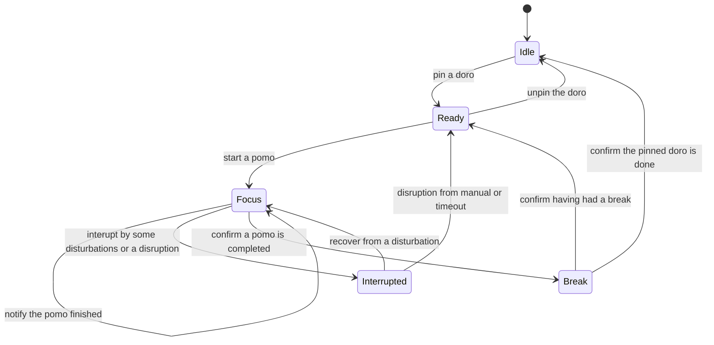
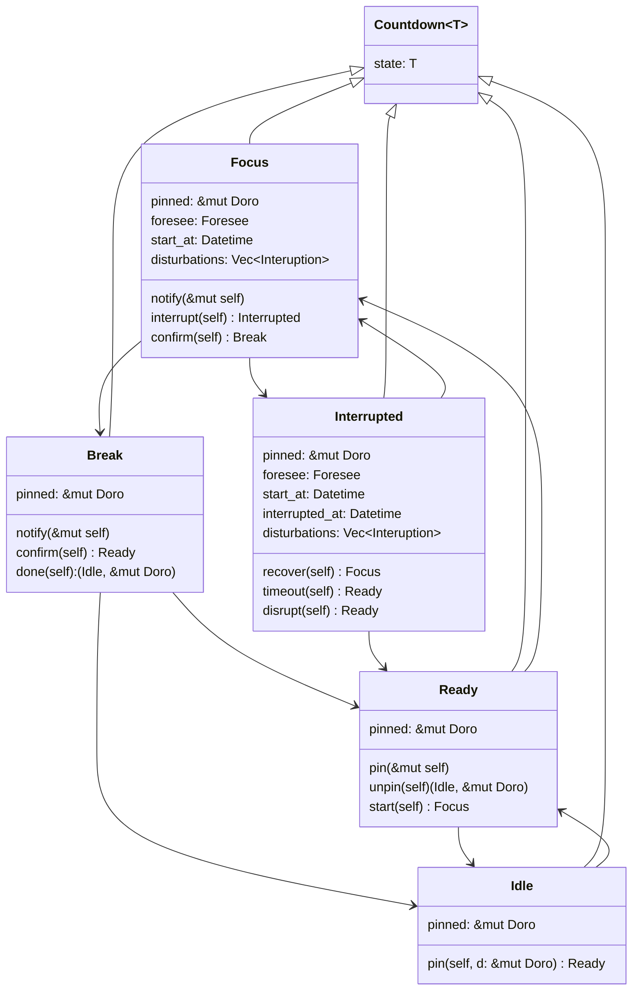

# sprint-0.0.3 Countdown redesign

> 1. 某一时刻最多只有一个番茄钟在运行

翻看了以前的设计，发现当时设计的全局唯一的番茄钟，还兼具了置顶项的功能——如果番茄钟没有挂载任务，就无法启动。考虑到目前设计中，活动清单与置顶项还有分割的情况，需要重新设计优化。

## 需求细化
1. 番茄倒计时（`Countdown`）作为置顶项（`Pin`），内部包含可空的置顶活动（`Doro`）
2. 当 `Countdown` 的置顶活动为空时，不允许启动番茄钟
3. `Countdown` 结束时，为置顶活动生成番茄钟记录（`Pomo`）

## 状态图

## 核心对象及其关系分析
考虑到 `Countdown` 具有较多的状态，各状态之间的迁移互有差别，因此采用[状态类型模式](https://rustcc.cn/article?id=e026f840-1c04-4f6e-b00e-95a475d7d317) 设计：

