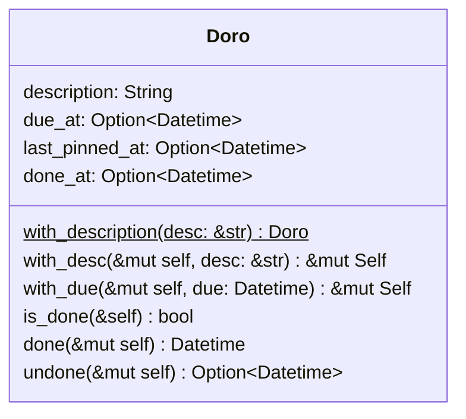
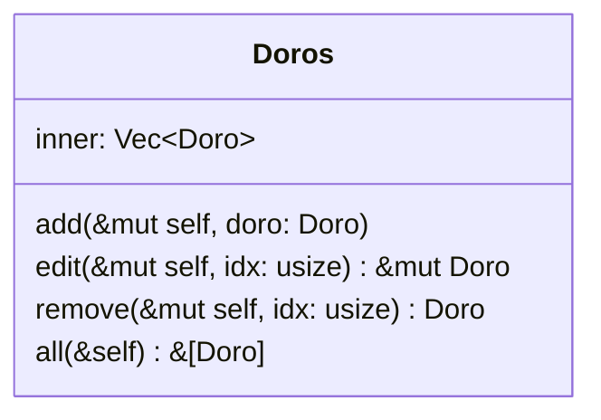
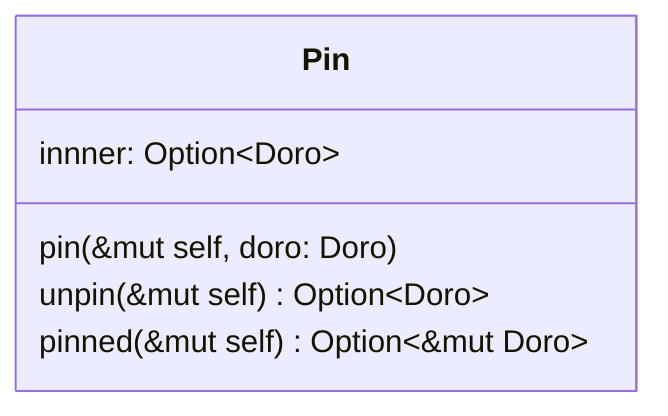
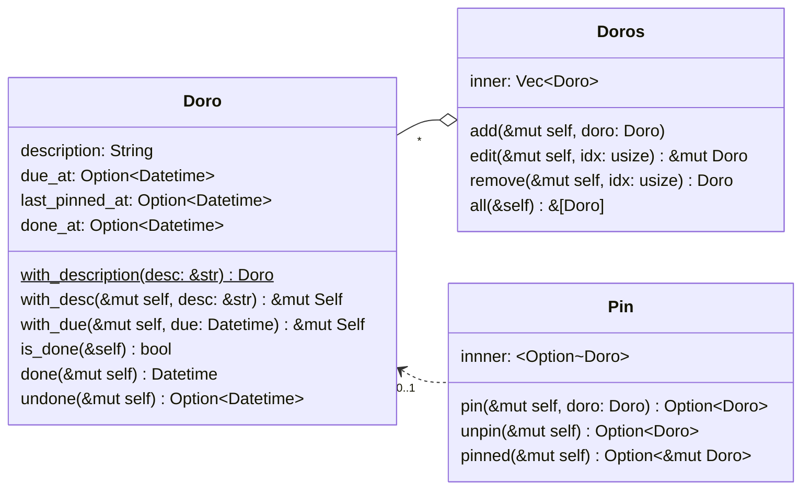
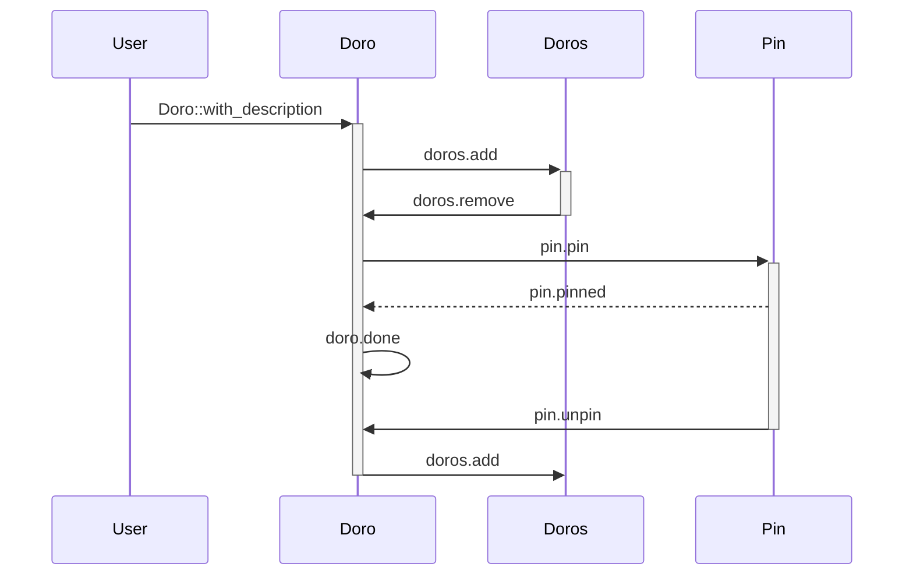

# sprint-0.0.1 Doro

> 1. 有活动清单
> 2. 专注于某个活动，或者置顶最多一个活动

## 需求细化
本次 sprint 将实现初版的活动清单，以及从活动清单中置顶最多一项活动。活动（Doro）是番茄工作法的核心对象，活动清单应当可以新增、编辑、删除（可回收）活动，也应该允许查询全部的活动。而作为番茄工作法应用，应当也具有专注/置顶于活动的功能。

## 核心对象分析
### 活动（Doro）
每一项活动的开展，都必然有其开始时间与结束时间。结束时间对应的是该项活动完成的时间，而且番茄工作法中，活动应当置顶后才进行开始，因此要记录最后置顶时间。此外，一些活动会有预期的截止时间，这与完成时间有区别。每一项活动创建时都必须有简短的描述来确定活动的主题，每一项活动都能够被标记为完成与未完成状态。

### 活动清单(Doros)
活动清单包含新增、编辑、删除（可回收）、查询活动的功能，也即活动清单的目的是管理活动。活动清单全局唯一。

### 置顶（Pin）
置顶是番茄工作才会存在的概念，其目的是从活动清单中挑选一项活动保持专注，直到活动完成。置顶项也是全局唯一的。置顶项可以任意置顶与取消，也可以获取内部活动的可访问引用（不使用`DerefMut` 是因为涉及到置顶项时总是可写的）。

## 对象关系分析
活动清单由单个的活动聚合而成，而置顶依赖被选定的活动而工作：

## 时序分析
时序分析主要是为了探讨在 Rust 的所有权模型下，是否会出现因对象所有权独占而无法被其他对象访问的情况。就活动、活动清单与置顶容器之间的互动，分析如下：

1. 活动的创建后应当转移至活动清单
2. 活动的操作应当由活动清单提取活动的独占可写引用来操作
3. 当要置顶一项活动时，应该从活动清单获取独占的所有权，理由如下：
    - 置顶活动通常预期是一直专注执行到完成，
    - 置顶活动执行时可能会产生中断，中断可能产生新的活动添加到活动清单中，如果置顶活动系活动清单的独占可写引用，就会产生所有权冲突

