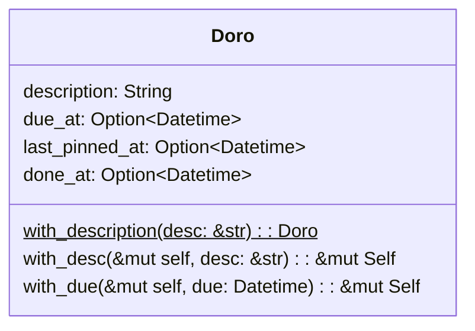

# sprint1-Doro

> 7.有活动清单
> 9.专注于某个活动，或者置顶最多一个活动

## 需求细化
本次 sprint 将实现初版的活动清单，以及从活动清单中置顶最多一项活动。活动（Doro）是番茄工作法的核心对象，活动清单应当可以新增、编辑、删除（可回收）活动，也应该允许查询全部的活动。而作为番茄工作法应用，应当也具有专注/置顶于活动的功能。

## 核心对象分析
### 活动（Doro）
每一项活动的开展，都必然有其开始时间与结束时间。结束时间对应的是该项活动完成的时间，而且番茄工作法中，活动应当置顶后才进行开始，因此要记录最后置顶时间。此外，一些活动会有预期的截止时间，这与完成时间有区别。每一项活动创建时都必须有简短的描述来确定活动的主题，每一项活动都能够被标记为完成与未完成状态。

