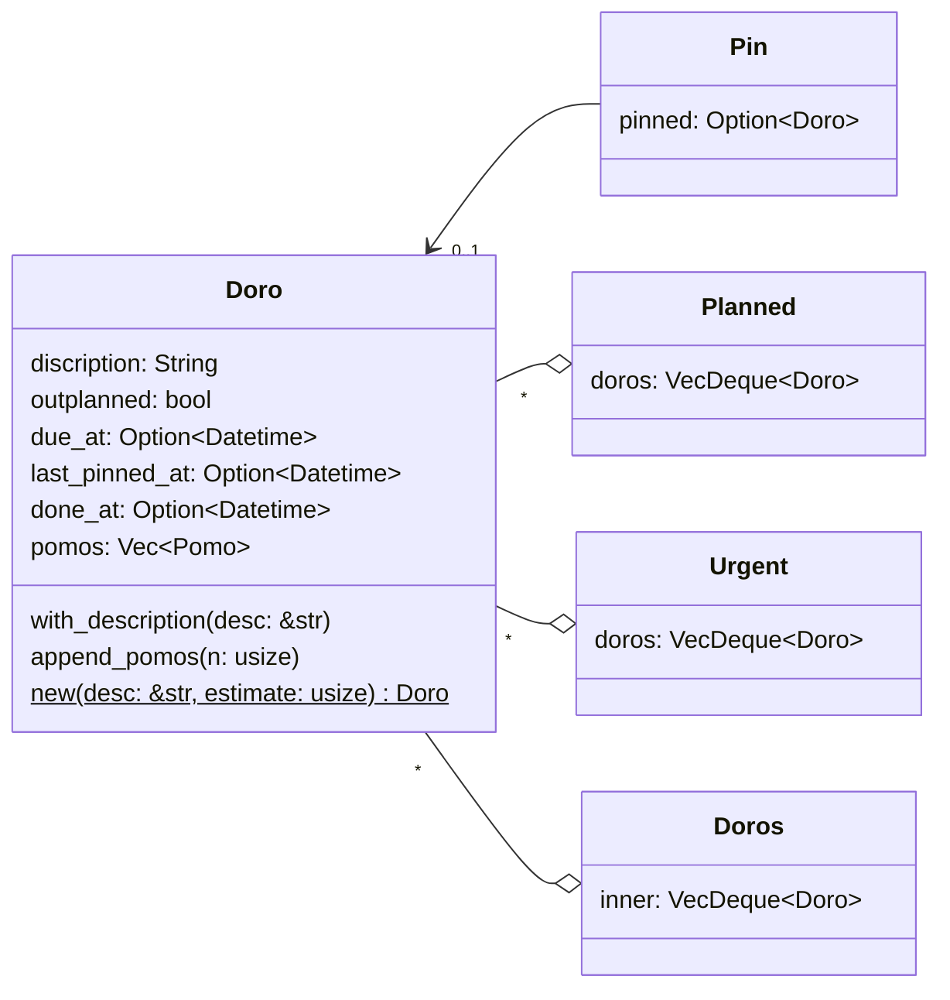
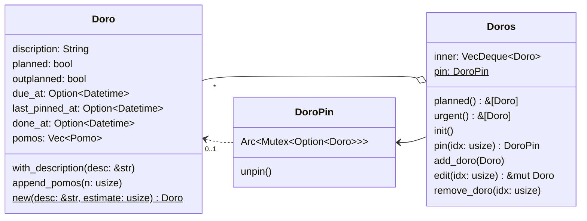
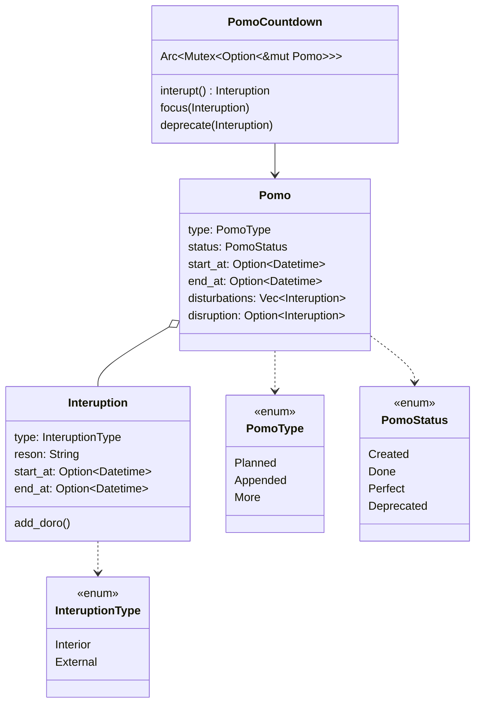
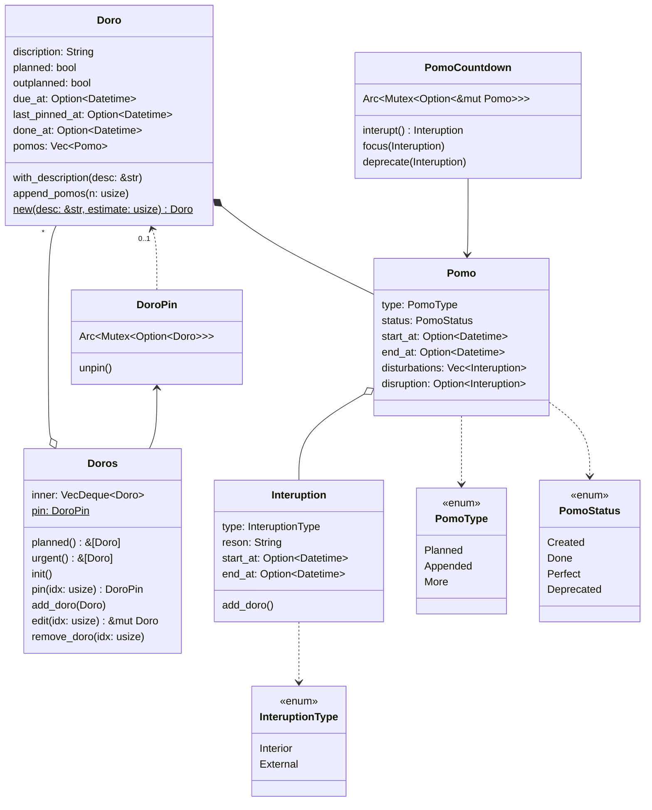

# sprint1-doro, pomo & estimate, interuption
## 需求细化
这次 sprint 要实现的需求是如下几点:

> 1. 所有番茄必须作为一件活动的预估耗时出现，并且区分三种预估
> 2. 番茄钟允许中断并记录，但更加鼓励通过调整计划执行出毫无中断的番茄钟（姑且叫作“完美番茄”）
> 3. 中断可以记录为急事与计划外活动，或打断并废弃当前番茄
> 4. 专注于某个任务，或者置顶最多一个任务
> 5. 某一时刻最多只有一个番茄钟在运行

我们先来看看需求1。因为番茄钟只会作为活动的预估出现，这也意味着只有在创建了活动（[Doro](#doro)）后，才有可能产生番茄（[Pomo](#pomo)），所以我们可以将番茄作为活动的一个属性来进行管理。我设想理想的交互是，在界面上有专门的若干灰色番茄图案，（这也意味着我们限制了一个活动可能预估的上限番茄数量——鼓励用户将活动拆分成具体可量化的活动），用户可以在这些图案上点击或者滑动来调整预估的番茄钟数量。而每个活动区分三种预估的思路如下：

1. 当用户在该活动下没有任何执行过的番茄时，任意调整评估番茄数量，评估的番茄都算是“计划好的”（Planned）番茄；
2. 当用户在该活动有执行过（完成状态为完成 Completed 或者废弃 Deprecated）的番茄，且最后一个执行过的番茄类型是 Planned 时，追加预估的番茄都算作“追加的（Appended）”。
2. 当用户在该活动有执行过（完成状态为完成 Completed 或者废弃 Deprecated）的番茄，且最后一个执行过的番茄类型是 Appended 或者 More 时，追加预估的番茄都算作“更多的（More）”。

接下来细化需求2、3。每次中断（[Interruption](#Interruption)）应当是有时间长度的，并且不会暂停番茄钟倒计时。而我之前的想法中中断x占比大于某个阈值（例如，单个番茄中的 30%），那么该番茄钟应该也是直接废弃，而中断占比小于阈值的番茄，算是一般完成的番茄（Completed）；而毫无中断完成的番茄算作完美（Perfect）的番茄。此外，中断区分干扰（disturbation）与打断（disruption）两种，前者结束后回归番茄钟专注状态，后者结束后直接归档番茄。关于中断可添加的急事(Urgent)与计划外活动（outplanned），急事主要用于当天必须要先处理的活动，如果当天未处理，归类到到计划外活动。显然，遇到能作为急事的中断，它也必然是计划外活动。换言之，紧急是一种临时的状态，而计划外是影响后续统计的常驻状态。

<!-- TODO: 更换为 mermaid 代码 -->
## 用例分析

在分析了以上需求后，我们得出的用例如上图所示。用户最核心的需求是管理活动，然后是借助番茄跟进活动执行情况。管理活动包括帮助用户专注在某一个活动上，而管理番茄又包含着预估单个活动需要的番茄数量，这种预估拓展了基础的管理代办活动的能力。此外，中断的记录与跟踪也扩展了管理番茄的能力。

## 核心对象及其关系分析
### Doro
活动是番茄工作法的核心对象。当人们想要记录下一个活动时，或许会对该活动截止完成时间(预期完成时间)有初步预估；与之相对的，该活动的实际开始时间（或者叫，最后一次置顶的时间）、实际结束时间则是另外一套需要记录下来的信息。而由于番茄工作法的特殊性，某一时刻最多仅会有一个活动“置顶”（Pinned）（需求4）。置顶可以视作全局唯一实例，下文的番茄钟倒计时同理（需求5）。此外，活动清单有专门预留给当天计划外紧急（Urgent）活动的空间，所以我们现在要考虑如何整合这几种相互关联的具体 Doro。

因为每个 `Doro` 都可能是计划外添加进来的事件，所以应当有一个唯一标记字段 `outplanned`，而计划外紧急活动是每天都需要重新跟进以反映当天计划情况的，因此独立出额外的列表 `Urgencies`来跟进。

然而以上的结构会存在以下问题：
1. 频繁的 Doro 移动
2. 在 Doros 清单看不到 TodayDoros 的事项
3. Today表里看不到置顶的事项

一个优化设计方法是，将除了存储了 `Doro` 对象的 `Doros` 清单以外，都做成 `Doros` 清单的视图，而 `DoroPin` 作为其唯一可操作项添加原子性操作：

### Pomo
类似的，番茄钟除了基本的开始与结束时间，还需要理清其类型（专用于某项实务的番茄钟还是常规工作节奏的番茄钟）、完成后的评级（坏、普通、完美的番茄）、预估类型（第几次预估）、包含的中断（干扰与打断），以及唯一锁定的、全局最多只有一个在运行的番茄钟。

合并以上的对象关系，当前涉及对象及其关系如下：

## 时序分析
