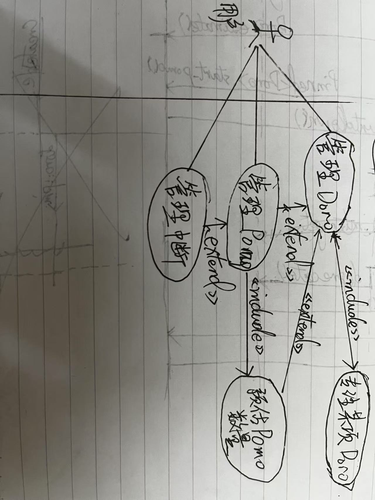

# sprint1-doro, pomo & estimate, interuption
## 需求细化
这次 sprint 要实现的需求是如下三点:

> 2. 所有番茄必须作为一件待办事项的预估耗时出现，并且区分三种预估
> 3. 番茄钟允许中断并记录，但更加鼓励通过调整计划执行出毫无中断的番茄钟（姑且叫作“完美番茄”）
> 4. 中断可以记录为急事与未计划事项，或打断并废弃当前番茄

我们先来看看需求2。因为番茄钟只会作为待办的预估出现，这也意味着只有在创建了待办事项（Doro）后，才有可能产生番茄（Pomo），所以我们可以将番茄作为待办事项的一个属性来进行管理。我设想理想的交互是，在界面上有专门的若干灰色番茄图案，（这也意味着我们限制了一个待办事项可能预估的上限番茄数量——鼓励用户将待办拆分成具体可量化的事项），用户可以在这些图案上点击或者滑动来调整预估的番茄钟数量。而每个待办事项区分三种预估的思路如下：

1. 当用户在该事项下没有任何执行过的番茄时，任意调整评估番茄数量，评估的番茄都算是“计划好的”（Planned）番茄；
2. 当用户在该事项有执行过（完成状态为完成 Completed 或者废弃 Deprecated）的番茄，且最后一个执行过的番茄类型是 Planned 时，追加预估的番茄都算作“追加的（Appended）”。这也意味着新预估的番茄数量总数不可以少于原本预估的番茄数量；
2. 当用户在该事项有执行过（完成状态为完成 Completed 或者废弃 Deprecated）的番茄，且最后一个执行过的番茄类型是 Appended 时，追加预估的番茄都算作“更多的（More）”。这也意味着新预估的番茄数量总数不可以少于原本预估的番茄数量。

接下来细化需求3、4。每次中断（Interruption）应当是有时间长度的，并且不会暂停番茄钟倒计时。而我之前的想法中中断x占比大于某个阈值（例如，单个番茄中的 30%），那么该番茄钟应该也是直接废弃，而中断占比小于阈值的番茄，算是一般完成的番茄（Completed）；而毫无中断完成的番茄算作完美（Perfect）的番茄。此外，中断区分干扰（disturbation）与打断（disruption）两种，前者结束后回归番茄钟专注状态，后者结束后直接归档番茄。关于中断可添加的急事(Urgent)与未计划事项（Unplanned），急事主要用于当天必须要先处理的事项，如果当天未处理，归类到到未计划事项。显然，遇到能作为急事的中断，它也必然是未计划事项。换言之，紧急是一种临时的状态，而未计划是影响后续统计的常驻状态。

<!-- TODO: 更换为 mermaid 代码 -->
## 用例分析

在分析了以上需求后，我们得出的用例如上图所示。用户最核心的需求是管理待办与管理番茄情况。管理待办包括帮助用户专注在某一个待办上，而管理番茄又包含着预估单个待办需要的番茄数量，这种预估拓展了基础的管理代办事项的能力。此外，中断的记录与跟踪也扩展了管理番茄的能力。

## 核心实体分析
## 对象关系分析
## 时序分析
