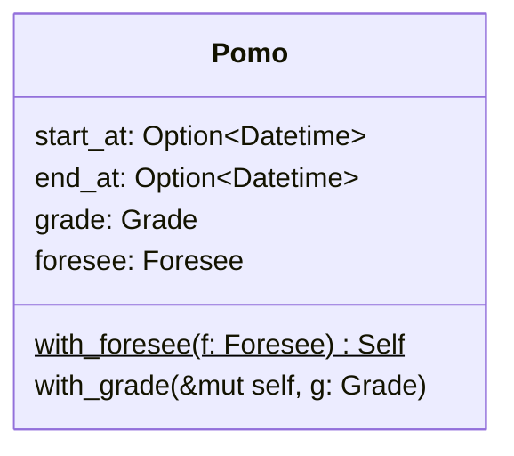
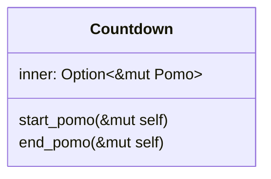
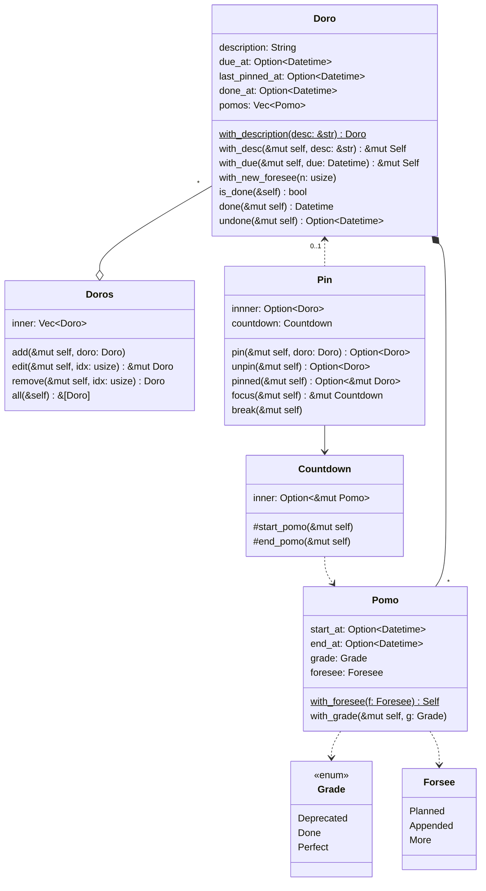
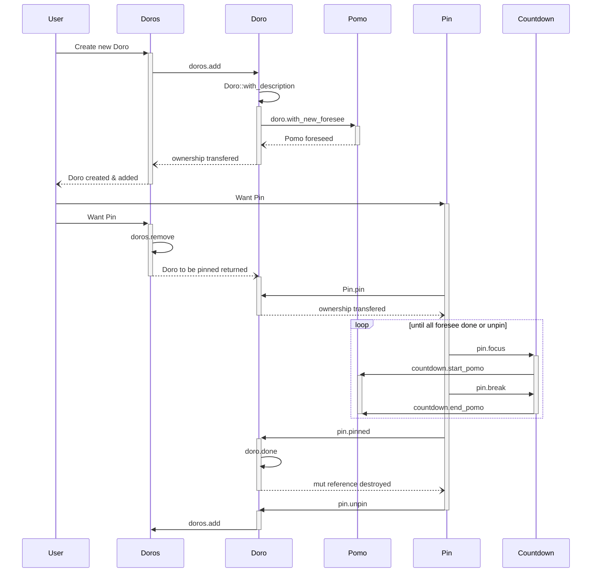

# sprint-0.0.2 Pomo

> 1. 有番茄倒计时
> 2. 所有番茄钟必须作为一件活动的预估耗时出现
> 3. 番茄钟的预估区分三种类型
> 4. 某一时刻最多只有一个番茄钟在运行

## 需求细化
本次 sprint 将在[上一个sprint](./doro.md)的基础上增加番茄与番茄钟（倒计时）功能。

首先，因为番茄钟只会作为活动的预估出现，这也意味着只有在创建了活动后，才有可能产生番茄，所以我们可以将番茄作为活动的一个属性来进行管理。我设想理想的交互是，在界面上有专门的若干灰色番茄图案，（这也意味着我们限制了一个活动可能预估的上限番茄数量——鼓励用户将工作量比较大的任务拆分成小而具体、可量化花费时间的活动），用户可以在这些图案上点击或者滑动来调整预估的番茄钟数量。而每个活动区分三种预估的思路如下：

1. 当用户在该活动下没有任何执行过的番茄时，任意调整评估番茄数量，评估的番茄都算是“计划好的”（Planned）番茄；
2. 当用户在该活动有执行过（完成状态为完成 Completed 或者废弃 Deprecated）的番茄，且最后一个番茄类型是 Planned 时，追加预估的番茄都算作“追加的（Appended）”。
2. 当用户在该活动有执行过（完成状态为完成 Completed 或者废弃 Deprecated）的番茄，且最后一个番茄类型是 Appended 或者 More 时，追加预估的番茄都算作“更多的（More）”。

然后，需求4可以参考 `Pin` 的设计方式，使用全局的 `Countdown` 实例来限制，并且倒计时只有置顶的任务才可以操作（启动、停止、完成，以及后续会有的中断），可以将 `Countdown` 作为 `Pin` 的内部属性进行管理。

## 核心对象分析
### Pomo
番茄(Pomo)除了基本的开始与结束时间，还需要理清完成后的评级（坏、普通、完美的番茄）、预估类型（第几次预估(foresee)）此外，番茄作为活动的耗时预估，其创建时必然是有预估类型的：

### Countdown
番茄钟/倒计时（CountDown）主要应用是启动/结束番茄，以及管理其中的专注-休息循环。注意，番茄总是由活动持有，而任何对番茄钟的启动/停止都是从置顶活动中操作，因此直接从置顶活动中获取可变引用即可。

## 对象关系分析
结合之前的分析，整体的对象关系有了以下变化点：
1. 引入了番茄，作为活动的耗时预估，以聚合属性的形式在活动项中进行管理
2. 引入番茄钟，仅在置顶项中才可以开始运行与结束

## 时序分析
如下图，重新分析时序：用户与单个活动对象的交互是作为管理活动清单操作的中的一部分，所以调整用户交互的时序，先与活动清单交互，再由活动清单与单个对象交互。同理，重新梳理了置顶项的交互。

