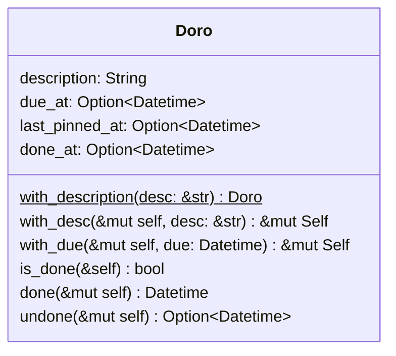
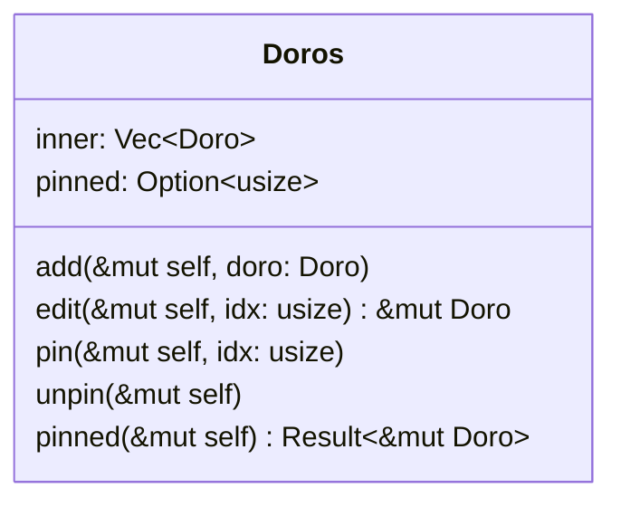
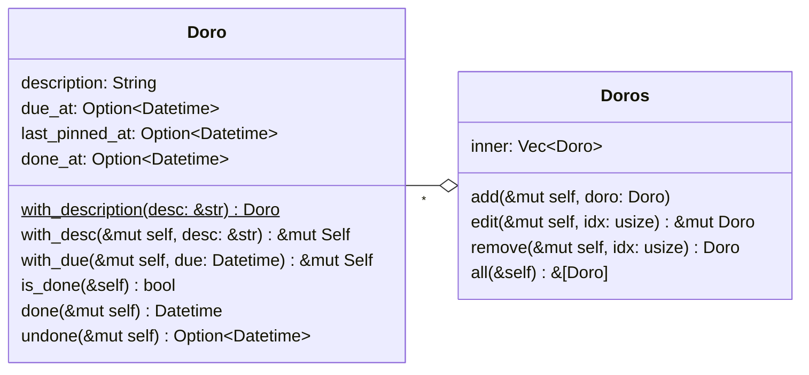
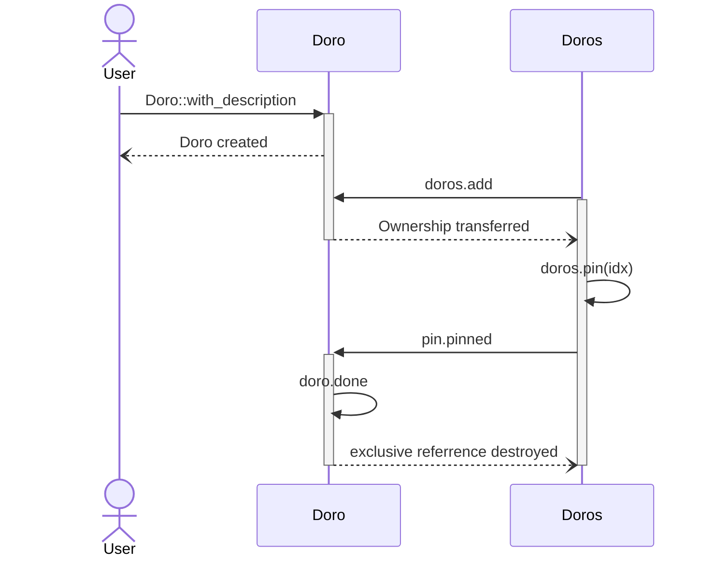

# sprint-0.0.1 todo

> 1. 有清单
> 2. 区分当天要完成的待办与计划外的待办
> 3. 专注于某个待办，或者置顶最多一个待办

## 需求细化
本次 sprint 将实现初版的待办清单、，以及从待办清单中置顶最多一项待办。待办（Doro）是番茄工作法的核心对象，待办清单应当可以新增、编辑、删除（可回收）待办，也应该允许查询全部的待办。而作为番茄工作法应用，应当也具有专注/置顶于待办的功能。

## 核心对象分析
### 待办（Doro）
每一项待办的开展，都必然有其开始时间与结束时间。结束时间对应的是该项待办完成的时间，而且番茄工作法中，待办应当置顶后才进行开始，因此要记录最后置顶时间。此外，一些待办会有预期的截止时间，这与完成时间有区别。每一项待办创建时都必须有简短的描述来确定待办的主题，每一项待办都能够被标记为完成与未完成状态。

### 待办清单(Doros) 与 置顶（Pin）
待办清单包含新增、编辑、删除（可回收）、查询待办的功能，也即待办清单的目的是管理待办。待办清单全局唯一。置顶是番茄工作才会存在的概念，其目的是从待办清单中挑选一项待办保持专注，直到待办完成。置顶项也是全局唯一的。置顶项可以任意置顶与取消。

## 对象关系分析
待办清单由单个的待办聚合而成，而置顶依赖被选定的待办而工作：

## 时序分析
时序分析主要是为了探讨在 Rust 的所有权模型下，是否会出现因对象所有权独占而无法被其他对象访问的情况。就待办、待办清单与置顶容器之间的互动，分析如下：

1. 待办的创建后应当转移至待办清单
2. 待办的操作应当由待办清单提取待办的独占可写引用来操作
3. 当要置顶一项待办时，应该从待办清单获取独占的所有权，理由如下：
    - 置顶待办通常预期是一直专注执行到完成，
    - 置顶待办执行时可能会产生中断，中断可能产生新的待办添加到待办清单中，如果置顶待办系待办清单的独占可写引用，就会产生所有权冲突

## 存储分析
以上分析忽略了一个很重要的设计要素：在 CLI 中，每次执行命令就必须直接写入嵌入数据库（如sqlite/turso），在后续可能实现的浏览器 UI 中，才可能考虑将多次操作同步到 Web 后端，而即使多次操作同步，也是每个操作依次同步到数据库中，因此分析核心对象的生命周期意义不大。
