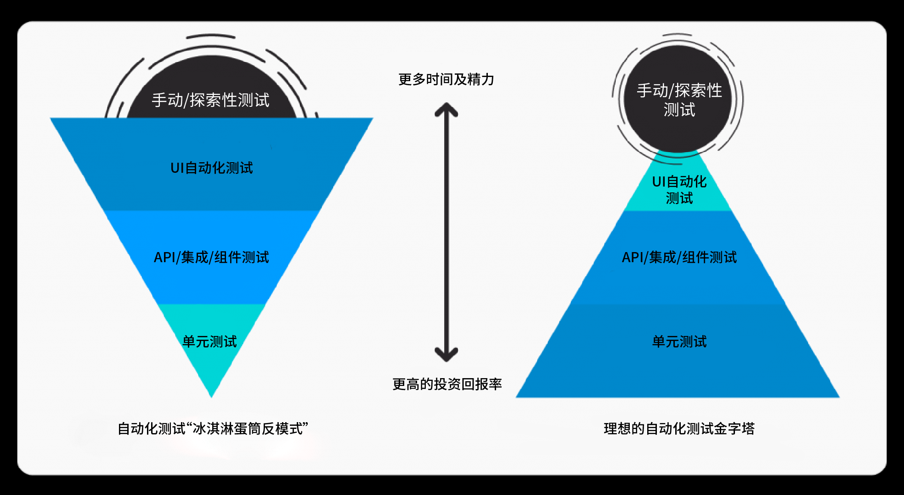

# 在 web 项目中使用 Rust 组织测试代码

## TL;DR
由于博主对 Python 依赖管理的不熟悉而无法解决其在管理复杂的自动化测试代码时的依赖报错、同事无法一键执行自动化测试用例等问题，改用了 Rust 来构建 Web 项目的测试用例集合。本文总结了一些基于测试粒度的测试用例设计决策，以及如何利用 Rust 的依赖管理工具 `Cargo` 来组织 web 测试用例。

## 测试金字塔
按照测试粒度划分，测试可以划分为单元测试、集成测试、系统测试等，而常见的 API 测试、UI 自动化测试则可以划分到集成测试/系统测试粒度上。 **在 Web 项目中，API测试应当理解为集成测试，甚至为系统测试（API作为对外产品提供服务）**，而单元测试应当是固定（mock）业务外部输入、关注单元内部逻辑实现以及期望输入输出的测试，例如，Java Web API 服务的的每个API可以划分为数据库单元与后端逻辑单元，每个单元分别配合固定的输入集合来得到实际输出与期望结果的对比情况，然后再反馈到单元内部逻辑自身，有助于提升代码质量。

但实际上由于项目的人手、工期等多方面因素，更多的项目的实践实际上是犹如下图右方的倒金字塔来实施测试。


## 为什么选择 Rust 而非 Python
Python 是一门非常适合编写即时性脚本的语言，能够简化很多不需要多模块相互之间复杂依赖的问题；但是缺点也很明显——在项目代码复杂性提高的情况下，由于缺乏 **强制的类型约束**，脚本函数之间互相识别不了输入的类型导致额外的脚本维护成本是经常出现的状况。

选择 Rust，主要是出于几个优点：
1. 安全、执行高效
2. 方便的模块化管理工具 `Cargo`
3. 编译通过、没有 panic 即期望结果
4. 相对学习成本低（对于博主个人来说）

但是要注意的是， Rust 的学习曲线其实是非常陡峭（可能需要吃透了整本 [The Rust Programming Language](https://doc.rust-lang.org/book/) 才能写出一个猜数字的 demo 程序），如果团队决定要学习的话，可能至少需要花两个星期甚至一个月时间才能形成有效的生产力。

## 实践no.1 -- Workspace
最开始因为 `goose` 性能框架支持 binary，并且认为可复用组件少而形成了单个负载测试独立作为项目、多个负责测试组成同一工作空间的架构：

```
workspace
|-- perf_binary1
    |-- src/main.rs
    |-- Cargo.toml
|-- perf_binary2
    |-- src/main.rs
    |-- Cargo.toml
|-- utils
    |-- src/lib.rs
    |-- Cargo.toml
|-- Cargo.toml
```

因为使用的是相同工作空间，多个项目之前可以共享依赖中间问题，但带来的问题是需要为每个负载测试创建新项目，增加配置复杂性。

## 实践no.2 -- 带有多个 binary 的 cargo 项目，使用 features 控制依赖
经常 [实践1](#实践no1----workspace)，发现了更好的方式通过 binary 的方式管理多个不同的负载测试用例，而 binary 所需的依赖可以作为可选依赖通过 `cargo features` 来引入：

```
project
    |-- src
        |-- bin
            |-- perf1.rs
            |-- perf2.rs
        |-- lib.rs
        |-- utils
            |-- util_module1.rs
            |-- util_module2.rs
            |-- ...
|-- Cargo.toml
```

## 总结
Python 和 Rust 作为管理测试用例的工具均有优缺点，但是在管理复杂测试用例，以及对抽取复用组件方面，博主认为 Rust 得益于 Cargo 和语言涉及比起 Python 有更大的优势；而 Python 在团队协作迁移有更大的优势。
